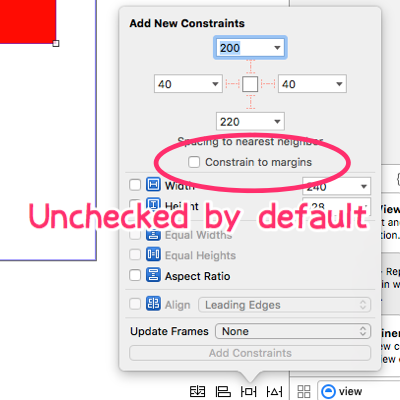

DefaultMarginDisabler
=====================
This is a Xcode Plugin sets a default value of 'Constrain to margins' to disabled.

Installation
------------
You can install the plugin via [Alcatraz](http://alcatraz.io/), the plugin manager for Xcode.

### For Xcode 8 or later

Xcode refuses to load unsigned code from Xcode 8. So you can't use this plugin as well. Not only this, but all of Xcode's plugins.
Currently, It seems that there is no "perfect" way to install them. There are some ways to avoid Xcode's restrictions, but they are not perfect. They cause Xcode to freeze or cause something bad.
See more details about this problem at [this page](https://github.com/alcatraz/Alcatraz/issues/475), etc.

License
-------
Public Domain
